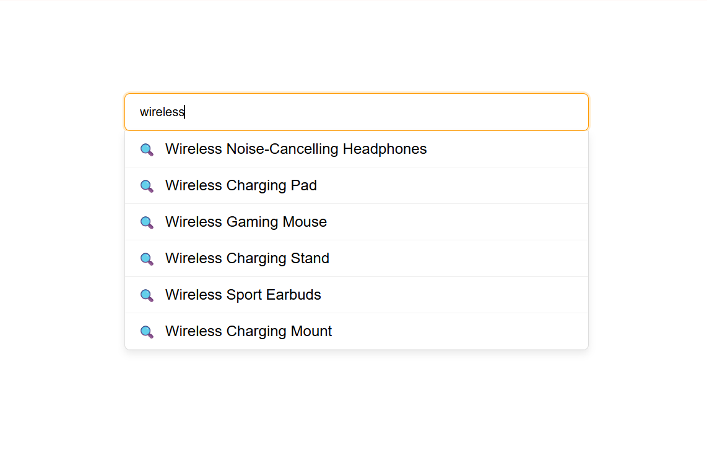

  

<h1 align="center">EX – Autocomplete (React)</h1>

Esercizio React sviluppato con **Vite**, focalizzato sull’ottimizzazione delle performance tramite `useCallback` e sull’implementazione di una ricerca intelligente con **debounce**.

Il progetto è strutturato seguendo **milestone incrementali**, per mostrare il passaggio da una semplice ricerca dinamica a un’implementazione ottimizzata che riduce le chiamate API inutili.

---

## Obiettivo dell’esercizio

- Creare un campo di ricerca dinamico
- Recuperare dati da un’API locale
- Mostrare suggerimenti in tempo reale
- Ottimizzare le chiamate API con debounce
- Stabilizzare le funzioni con `useCallback`

---

## Descrizione generale

L’applicazione implementa un **campo di ricerca con autocomplete**, simile a quello utilizzato negli e-commerce.

Quando l’utente digita:
- vengono mostrati suggerimenti dinamici sotto l’input
- la ricerca viene ritardata di 300ms
- vengono evitate chiamate API ad ogni singola digitazione

L’esercizio è pensato per rafforzare i concetti di **closure, debounce e stabilizzazione delle funzioni in React**.

---

## Anteprima

---

## 📌 Milestone 1: Ricerca con suggerimenti dinamici

**Obiettivo:** Mostrare suggerimenti in base al testo digitato.

### Requisiti

1. Creare un campo `<input type="text">`.
2. Effettuare una chiamata API a:  
   `http://localhost:3333/products?search=[query]`
3. Salvare i risultati in uno stato React tramite `useState`.
4. Mostrare i suggerimenti sotto l’input in una tendina.
5. Nascondere la tendina quando l’input è vuoto.

---

## 📌 Milestone 2: Ottimizzazione con Debounce

**Obiettivo:** Ridurre il numero di richieste API e migliorare le performance.

### Requisiti

1. Implementare una funzione `debounce` generica.
2. Ritardare la chiamata API di 300ms.
3. Eseguire la ricerca solo dopo un breve periodo di inattività.
4. Utilizzare `useCallback` per stabilizzare la funzione debounced.
5. Evitare chiamate API ad ogni pressione di tasto.

---

## Tecnologie utilizzate

- React
- Vite
- Postman (test API locale)
